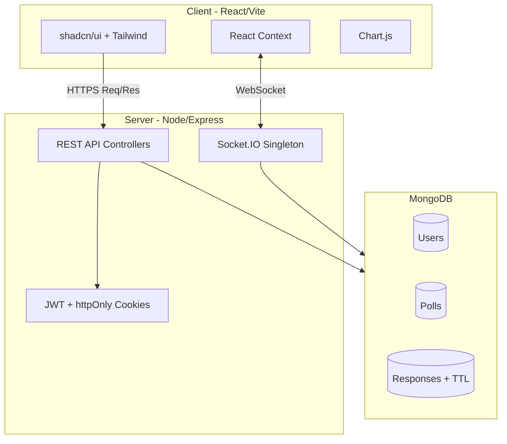

<div align="center">
  
  <h1>PollVault 🏛️</h1>
  <p><strong>A production-ready, real-time polling and survey platform built for modern teams.</strong></p>
  
  [](https://opensource.org/licenses/MIT)
  [](https://reactjs.org/)
  [](https://expressjs.com/)
  [](https://www.mongodb.com/)
  [](https://socket.io/)
</div>

<br />

PollVault empowers creators to build engaging, multi-type questionnaires, securely collect responses (anonymously or via authentication), and monitor real-time, live-updating analytics through a premium, interactive dashboard.

---

## ✨ Key Features

### 🛠️ Versatile Poll Creation
- **Multi-Type Questions**: Mix and match single-choice, multiple-choice, and open-ended text questions within a single poll.
- **Granular Controls**: Toggle required fields, set explicit expiration dates, and define response visibility.
- **Response Modes**: Choose between `Anonymous` (anyone with the link) and `Authenticated` (requires a registered account).

### ⚡ Real-Time Live Analytics
- **Socket.IO Integration**: Poll creators receive instant, live updates on their dashboard the moment a respondent submits an answer.
- **Targeted Broadcasting**: Uses Socket.IO rooms (`poll_${id}`) to ensure data is only pushed to authorized creators currently viewing the analytics page.
- **Dynamic Visualizations**: Beautiful, interactive Bar and Doughnut charts powered by `Chart.js`.

### 👑 Role-Based Admin Dashboard
- **RBAC**: Secure role-based access control protecting premium analytics routes and UI components.
- **Global Metrics**: Admins get exclusive access to a premium dashboard displaying platform-wide user registrations, poll statuses, and total responses.
- **CLI Seeder**: Included developer script to instantly promote any user to an admin via the terminal.

### 🛡️ Enterprise-Grade Security & Anti-Abuse
- **`httpOnly` Cookies**: Authentication is handled entirely via secure, HTTP-only cookies to prevent XSS attacks. No JWTs in `localStorage`.
- **Server-Side Fingerprinting**: Anonymous polls use a robust SHA-256 hash of the respondent's `IP` and `User-Agent` to prevent duplicate submissions and ballot stuffing. Enforced via MongoDB compound unique indexes.
- **Environment-Aware Rate Limiting**: Dedicated rate limiters for authentication, submissions, and general API requests to protect against brute-force and DDoS attacks.
- **Helmet & CORS**: Strict Content Security Policies (CSP) and Cross-Origin Resource Sharing rules.
- **Data Lifecycle Management**: MongoDB Time-To-Live (TTL) indexes automatically purge abandoned responses 30 days after submission to prevent unbounded database growth.

### 🚀 High-Performance Architecture
- **Optimized MongoDB Aggregations**: Dashboard statistics utilize targeted `$lookup` and `$group` aggregations (O(1) database operations) rather than pulling raw documents into Node.js memory.
- **N+1 Query Elimination**: Carefully tuned controllers ensure that fetching paginated polls alongside their response counts requires minimal database trips.

---

## 🏗️ System Architecture

PollVault uses a decoupled client-server architecture managed as a single monorepo for superior Developer Experience (DX).



---

## 📁 Repository Structure

```text
poll-vault/
├── client/                 # Frontend React Application
│   ├── public/
│   ├── src/
│   │   ├── api/            # Axios instance and API service wrappers
│   │   ├── components/     # Reusable UI components (shadcn, forms, charts)
│   │   ├── context/        # Auth and Socket.IO React Context providers
│   │   ├── lib/            # Utilities (e.g., Chart.js global setup)
│   │   └── pages/          # Full-page routing components
│   └── vite.config.js      # Vite config with API proxy proxy
├── server/                 # Backend Express Application
│   ├── config/             # Database connection setup
│   ├── controllers/        # Core business logic and aggregations
│   ├── middleware/         # Auth, validation (express-validator), error handling
│   ├── models/             # Mongoose schemas (User, Poll, Response)
│   ├── routes/             # Express router definitions
│   ├── scripts/            # CLI utilities (e.g., makeAdmin.js)
│   ├── socket/             # WebSocket initialization and event handlers
│   ├── tests/              # Jest unit tests for pure functions
│   └── utils/              # Helper functions (fingerprinting, JWT generation)
├── Dockerfile              # Production multi-stage Docker build
├── render.yaml             # Render Blueprint for 1-click deployment
└── package.json            # Monorepo orchestration (concurrently)
```

---

## 🛠️ Quick Start (Local Development)

### Prerequisites
- [Node.js](https://nodejs.org/) (v18 or higher recommended)
- [MongoDB](https://www.mongodb.com/) running locally or a MongoDB Atlas connection string.

### 1. Clone & Install
The project uses a root `package.json` to orchestrate installations across both the client and server.
```bash
git clone https://github.com/yourusername/poll-vault.git
cd poll-vault
npm run install:all
```

### 2. Environment Variables
Create a `.env` file in the root directory:
```env
PORT=5000
MONGODB_URI=mongodb://localhost:27017/pollvault
JWT_SECRET=your_super_secret_jwt_key_at_least_32_chars
CLIENT_URL=http://localhost:5173
NODE_ENV=development
```

### 3. Start the Development Servers
Using `concurrently`, this command starts the backend and waits for the API health check to pass before launching the Vite frontend.
```bash
npm run dev
```
- Frontend: [http://localhost:5173](http://localhost:5173)
- Backend: [http://localhost:5000](http://localhost:5000)

### 4. Run Tests
The backend includes Jest unit tests for core utilities and status calculations.
```bash
cd server
npm test
```

### 5. Create an Admin User (Optional)
To access the premium Admin Dashboard, you must promote your account to the `admin` role. After registering an account via the UI, run:
```bash
node server/scripts/makeAdmin.js your_email@example.com
```

---

## 🚢 Deployment

PollVault is strictly engineered for production environments.

### Option A: Render (1-Click Deploy)
Link your GitHub repository to [Render](https://render.com) and use the provided `render.yaml` Blueprint to automatically provision the web service. You will only need to supply the `MONGODB_URI` securely in the Render dashboard.

### Option B: Docker
A multi-stage `Dockerfile` is included to build and serve the entire application from a single lightweight Node Alpine container.

```bash
# Build the image
docker build -t poll-vault-prod .

# Run the container (ensure your .env has production values)
docker run -p 8000:8000 --env-file .env poll-vault-prod
```
*Note: The Dockerfile builds the Vite static assets and configures Express to serve them from `client/dist`.*

---

## 🧪 Tech Stack Details

- **Frontend Core**: React 18, Vite, React Router v6.
- **Styling**: Tailwind CSS, `shadcn/ui`, `lucide-react` icons.
- **Backend Core**: Node.js, Express.js.
- **Database**: MongoDB, Mongoose ODM.
- **Real-Time**: Socket.IO (v4).
- **Security**: `bcryptjs`, `jsonwebtoken`, `helmet`, `express-rate-limit`, `cookie-parser`.
- **Validation**: `express-validator`.
- **Testing**: `jest`.

---

## 📄 License

This project is licensed under the MIT License - see the LICENSE file for details.
